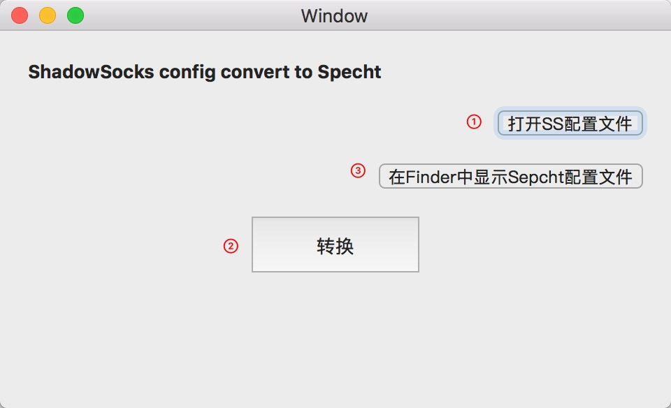

# SS2Specht

#### 项目介绍

[ShadowsSocks](https://github.com/shadowsocks)  配置文件 `json` 转为 [Specht](https://github.com/zhuhaow/Specht) 配置文件 `yaml` 的小工具。

配置 [SpechtLiteConf](https://github.com/HoonHwang/SpechtLiteConf) 模板使用即可。具体软件使用请查看  [Specht](https://github.com/zhuhaow/Specht)  WIKI。

#### 安装教程

方式一：自行编译，需要先 `pod install` 

方式二：Releases 下载

#### 使用说明

#### 参与贡献

1. Fork 本项目
2. 新建 Feat_xxx 分支
3. 提交代码
4. 新建 Pull Request

#### 许可证

MIT